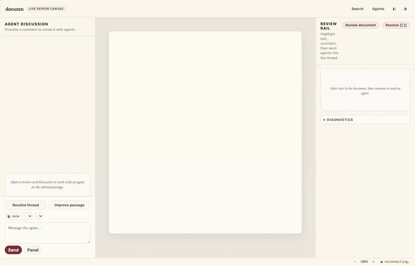

# docuzen

> An AI copilot for reviewing documents — highlight a line, leave a comment, and let agents discuss it and propose edits you approve, right on your Markdown.

<p align="center"></p>

## What is docuzen?

docuzen is a desktop app for AI-native document review. You open a Markdown or HTML document and work through it the way you'd review a colleague's draft: highlight a passage, leave an inline comment, and — when you want a second opinion — promote that comment into a discussion with an AI agent. Agents can take a stance (neutral, critiquer, or supporter), propose concrete edits you approve or reject, review the whole document, or resolve inline `[[ ... ]]` directives. You stay the author: docuzen never changes your file unless you accept an edit, and it keeps its review state privately under a `.docuzen/` directory that never touches the document itself.

## Features

- **Inline comments** on Markdown and rendered HTML — highlight text and comment right where it matters.
- **Agent discussions** — promote any comment into a threaded discussion with an AI agent; choose a neutral, critiquer, or supporter stance.
- **Proposed edits you control** — the agent proposes changes as a diff; you Approve or Reject. Nothing is written without your say-so.
- **Document-wide review** — ask the agent to review the whole document and surface findings.
- **`[[ ... ]]` directives** — leave inline instructions and have the agent resolve them.
- **Version snapshots** — every accepted change is snapshotted; restore any prior version.
- **Per-document settings** — model, tool scope, direct vs. proposed edits, standing instructions, and web-search provider.
- **Portable `.hadz` bundles** — export a document with its full review history and re-import it elsewhere.

## Install (macOS)

```bash
curl -fsSL https://raw.githubusercontent.com/docuzen/docuzen/main/install.sh | sh
```

This installs the app to `/Applications` (checksum-verified; Apple Silicon or Intel) and a `docuzen` command:

- `docuzen` — launch the app (`docuzen open ./file.md` opens a document)
- `docuzen update` — upgrade to the latest release
- `docuzen uninstall` — remove the app (prompts before deleting `~/.docuzen`)
- `docuzen doctor` — check the install and the configured agent harness

Builds are unsigned until code signing lands; the installer clears the macOS 15+ Gatekeeper quarantine for you. Prefer a manual download? Grab a `.dmg` from [Releases](https://github.com/docuzen/docuzen/releases) and run `xattr -cr /Applications/docuzen.app` after copying it in.

On first launch, docuzen asks you to pick an agent harness — **Pi** or **Codex CLI** — and stores the choice in `~/.docuzen/config.toml`. Until a harness is configured, documents open and every review feature works, but live agent discussion is disabled.

## Run from source (developers)

Prerequisites: Node.js 20+, Rust/Cargo, and Tauri's native dependencies (`xcode-select --install` on macOS). See [docs/install.md](docs/install.md) for per-OS details and full build/test commands.

```bash
npm install
npm run build
npm link
docuzen                 # launch the dev app
docuzen open ./file.md  # open a specific document
```

For model configuration, build/test commands, and troubleshooting, see [docs/install.md](docs/install.md).

## How it works

docuzen is a Tauri desktop app (`apps/desktop`) backed by a Node sidecar, `docd` (`packages/docd`), which stores review state under the nearest `.docuzen/` root — never inside your document. See [docs/architecture.md](docs/architecture.md) for the module map, the agent turn lifecycle, and the verification tooling.

## Repository layout

- `apps/desktop` — Tauri v2 app, Vite frontend, and dev launcher.
- `packages/docd` — TypeScript sidecar server, `.docuzen/` storage, agent runner, RPC, and tests.

## Limitations

- The dev launcher opens the bundled sample document first; use **File → Open…** (`Cmd/Ctrl+O`) for your own docs.
- Release builds are self-contained (the `docd` sidecar ships inside the app) but remain unsigned until code signing lands.
- Live agent use needs a configured harness (Pi or Codex CLI); without one, discussion is disabled but everything else works.
- Web search defaults to DuckDuckGo's keyless Instant Answer API; Brave and Tavily need API keys.

## License

Copyright 2026 docuzen. Licensed under the [Apache License, Version 2.0](LICENSE).
