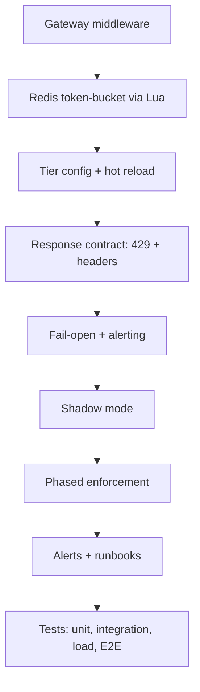
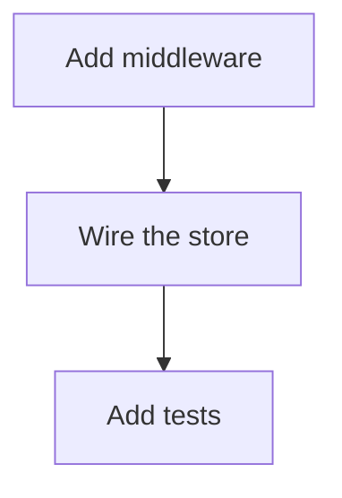

# Plan: Add phased rate limiting at the API gateway

## Approach

We will add a token-bucket limiter at the gateway, implemented in Redis via an atomic Lua script (check-and-decrement in one round trip). Buckets are keyed by `(api_key, route_class)` with per-tenant and per-IP secondary limits layered on top; defaults come from a tier table with per-key overrides hot-reloaded from the control plane. Each bucket's Redis entry uses a TTL of roughly 2× its refill interval — just long enough to evict idle keys, not the quota window itself. If Redis is unreachable the limiter fails open and emits a high-severity alert. Rejections return `429` with `Retry-After` and `RateLimit-Limit`/`-Remaining`/`-Reset` headers (per the IETF draft), and we distinguish quota-exceeded from suspected-abuse responses in both the body and metrics.  \[\[cite blogs from fortune 500 describing best practices for api gateway design]]

## Rollout

We roll out in phases rather than enabling enforcement for all tenants on day one. First, run the limiter in shadow mode for all tenants to validate bucket keys, tier defaults, overrides, Redis latency, and projected `429` volume without rejecting traffic. Next, enable enforcement for internal/test tenants, then a small canary cohort per tier and route class, expanding only when rejection rates, Redis errors, and latency stay within SLO-derived thresholds. Alerts fire if unexpected rate-limit rejections exceed a small threshold per tenant, tier, route class, or globally; expected quota-exceeded traffic is tracked separately from suspected abuse. \[\[cite academic papers]]

## Steps

1.## Steps

1. **Gateway middleware**: add a rate-limit middleware in the request path that resolves `(api_key, route_class)`, tenant, and client IP, then consults the limiter before forwarding upstream.
2. **Redis token-bucket via Lua**: implement check-and-decrement as a single atomic Lua script (one round trip) covering the primary `(api_key, route_class)` bucket plus layered per-tenant and per-IP buckets; set each entry's TTL to ~2× its refill interval.
3. **Tier config + hot reload**: load tier defaults and per-key overrides from the control plane, with hot reload and a safe fallback to the last known-good snapshot.
4. **Response contract**: on rejection, return `429` with `Retry-After` and `RateLimit-Limit`/`-Remaining`/`-Reset` headers (per the IETF draft), and distinguish quota-exceeded from suspected-abuse in both body and metrics.
5. **Fail-open + alerting**: if Redis is unreachable, fail open and emit a high-severity alert; expose counters for allow/deny, quota-exceeded vs. abuse, Redis errors, and script latency.
6. **Shadow mode**: ship the limiter evaluating all traffic but not rejecting, logging would-be decisions to validate bucket keys, tier defaults, overrides, Redis latency, and projected `429` volume.
7. **Phased enforcement**: enable rejection for internal/test tenants, then a small canary cohort per tier and route class, expanding only while rejection rates, Redis errors, and latency stay within SLO-derived thresholds.
8. **Alerts + runbooks**: wire alerts for unexpected rejection spikes per tenant, tier, route class, and global, separated from expected quota-exceeded traffic; document rollback (flip back to shadow) and override procedures.
9. **Tests**: unit tests for the Lua script (refill, burst, concurrent decrement, TTL); integration tests for layered buckets, config reload, fail-open, and `429` headers; load tests validating Redis latency under peak; end-to-end shadow-vs-enforce parity checks.

