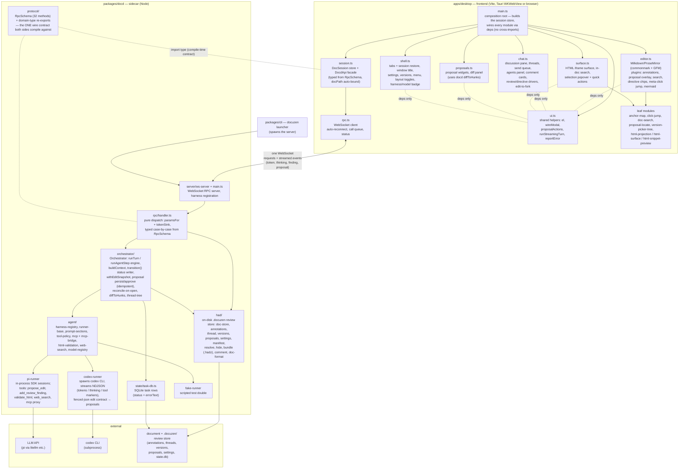
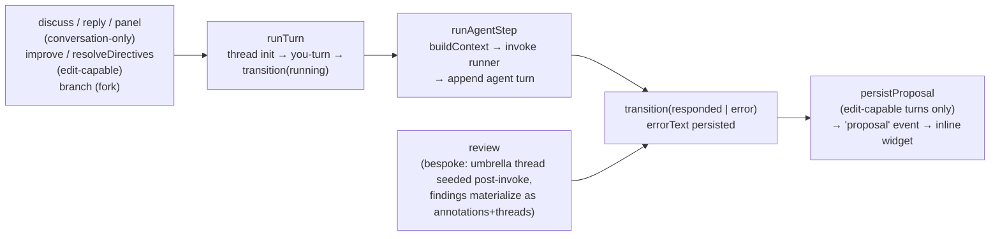

# Docuzen Architecture

Docuzen is a document-review desktop app: a **Tauri/WKWebView frontend** (also runs in a plain browser during development) talking over one WebSocket to a **Node sidecar (`docd`)** that owns all document state, agent orchestration, and LLM harnesses. Review state lives in a hidden `.docuzen/` directory at the repo root (`.docuzen/<relpath>.had/`; next to the document when it isn't in a git repo) — the document itself is never written except by explicit edit actions, and `.docuzen/` stays out of `git status` via the user's global git excludes file. Portable bundles use `.hadz`.

## System overview

## Agent turn lifecycle

Every agent interaction flows through one engine; the six entry points differ only in the spec they build. Conversation turns (discuss/reply/panel) never carry edit capability; explicit actions (Improve, Resolve `[[ ]]`, Review) do.

Key invariants the code enforces:

- **One wire contract.** `protocol/rpc.ts` types both the handler's dispatch and the desktop facade; adding a field on one side is a compile error until both agree.
- **One status writer.** `transition()` is the only code that writes turn status to the TaskDB and thread frontmatter; `reconcile()` (run on every document open) repairs rows orphaned by a crash, and one bad row can never block a document from opening.
- **One apply path.** `approveProposal` handles hunks, full rewrites, and legacy single-span proposals (converted at approve time); approve/reject are idempotent — re-resolving an already-resolved proposal reports its status instead of corrupting it.
- **Conversation ≠ edit.** Tool policy, prompt contracts, and the Codex reply parser all key off the same context predicate.

## Verification tooling

| Tool | What it proves | Run |
|---|---|---|
| Unit/integration suites (docd 376, desktop 238) | module behavior; orchestration via injected `FakePiRunner` | `npm test` |
| `tools/parity/` | branch behaves identically to `main` across scripted browser flows (boot, render, search, annotate, persistence, panels) | `node tools/parity/run.mjs --main <tree> --candidate <tree>` |
| `tools/parity/reconnect-drill.mjs` | live kill/restart of the sidecar under a running app self-heals without reload | `node tools/parity/reconnect-drill.mjs` |
| `tools/visual/` | 12 baseline screenshots (key states × light/dark OS scheme) pixel-match | `npm run visual` (`--update` to accept changes) |
