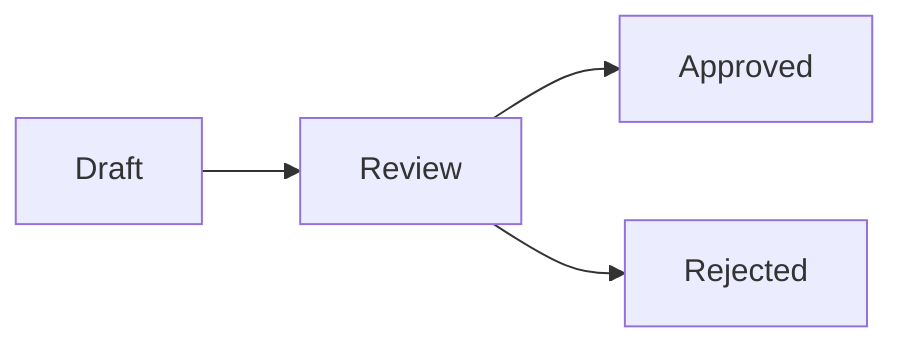

# Visual regression fixture

A short paragraph anchors the annotate flow — this sentence exists so there is
plain prose to triple-click and comment on, separate from the table below.

Rate limiting uses a **token-bucket** algorithm with per-key buckets stored in
`redis`. This line intentionally repeats terms that also appear in the table,
so a single search term produces matches in both prose and a table cell.

## Feature matrix

| Feature | Status | Notes |
| --- | --- | --- |
| **Rate limiting** | Done | Uses `token-bucket` algorithm |
| Auth middleware | In progress | Wraps `authMiddleware()` |
| Legacy retries | Deprecated | ~~Removed in v2~~ |
| Autolink check | Done | See https://example.com/docs |

## Request flow

```
┌─────────┐     ┌───────────┐     ┌──────────┐
│ Client  │ --> │  Gateway  │ --> │  Backend │
└─────────┘     └───────────┘     └──────────┘
      │               │
      └──── retry ─────┘
```

Trailing paragraph after the code block, confirming content below a fence
still renders and doesn't get swallowed.

## Annotation lifecycle



Trailing paragraph after the mermaid diagram, confirming content below a
rendered diagram still renders and doesn't get swallowed either.
